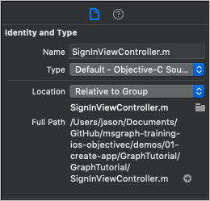
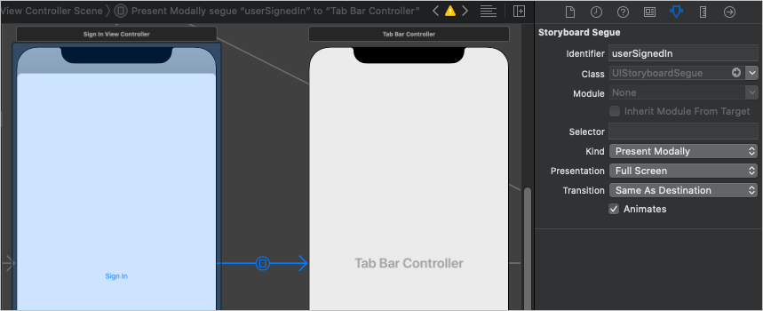

<!-- markdownlint-disable MD002 MD041 -->

Начните с создания нового проекта SWIFT.

1. Откройте Xcode. В меню **файл** выберите пункт **создать**, а затем — **проект**.
1. Выберите шаблон **приложения с одним представлением** и нажмите кнопку **Далее**.

    

1. Задайте для **имени продукта** значение `GraphTutorial` , а для **языка** значение **Цель — C**.
1. Заполните оставшиеся поля и нажмите кнопку **Далее**.
1. Выберите расположение для проекта и нажмите кнопку **создать**.

## <a name="install-dependencies"></a>Установка зависимостей

Перед перемещением установите некоторые дополнительные зависимости, которые будут использоваться позже.

- [Библиотека проверки подлинности Microsoft (MSAL) для iOS](https://github.com/AzureAD/microsoft-authentication-library-for-objc) для проверки подлинности в Azure AD.
- [Пакет SDK Microsoft Graph для задания на языке C](https://github.com/microsoftgraph/msgraph-sdk-objc) для совершения вызовов в Microsoft Graph.
- [Пакет SDK моделей Microsoft Graph для задания с](https://github.com/microsoftgraph/msgraph-sdk-objc-models) строго типизированными объектами, представляющими ресурсы Microsoft Graph, такие как "Пользователи" или "события".

1. Выйдите из Xcode.
1. Откройте терминал и измените каталог на путь к проекту **графтуториал** .
1. Выполните следующую команду, чтобы создать Podfile.

    ```Shell
    pod init
    ```

1. Откройте Podfile и добавьте следующие строки сразу после `use_frameworks!` строки.

    ```Ruby
    pod 'MSAL', '~> 1.1.1'
    pod 'MSGraphClientSDK', ' ~> 1.0.0'
    pod 'MSGraphClientModels', '~> 1.3.0'
    ```

1. Сохраните Podfile, а затем выполните следующую команду, чтобы установить зависимости.

    ```Shell
    pod install
    ```

1. После выполнения команды откройте недавно созданный **графтуториал. xcworkspace** в Xcode.

## <a name="design-the-app"></a>Проектирование приложения

В этом разделе вы создадите представления приложения: страница входа, навигатор панели вкладок, страница приветствия и страница календаря. Вы также создадите наложение индикатора действий.

### <a name="create-sign-in-page"></a>Страница "Создание входа"

1. Разверните папку **графтуториал** в Xcode, а затем выберите файл **ViewController. m** .
1. В **инспекторе файлов**измените **имя** файла на `SignInViewController.m`.

    

1. Откройте **сигнинвиевконтроллер. m** и замените его содержимое приведенным ниже кодом.

    ```objc
    #import "SignInViewController.h"

    @interface SignInViewController ()

    @end

    @implementation SignInViewController

    - (void)viewDidLoad {
        [super viewDidLoad];
        // Do any additional setup after loading the view.
    }

    - (IBAction)signIn {
        [self performSegueWithIdentifier: @"userSignedIn" sender: nil];
    }
    @end
    ```

1. Выберите файл **ViewController. h** .
1. В **инспекторе файлов**измените **имя** файла на `SignInViewController.h`.
1. Откройте **сигнинвиевконтроллер. h** и измените все экземпляры `ViewController` to. `SignInViewController`

1. Откройте файл **Main. Storyboard** .
1. Разверните панель **View Controller сцена**и выберите **View Controller (просмотреть контроллер**).

    

1. Выберите **инспектор удостоверений**, а затем измените раскрывающееся меню **Class** на **сигнинвиевконтроллер**.

    

1. Выберите **библиотеку**, а затем перетащите **кнопку** на **Контроллер входа в систему**.

    

1. Когда выбрана кнопка, выберите **инспектор атрибутов** и измените **название** кнопки на `Sign In`.

    

1. Выполнив выбранную кнопку, нажмите кнопку **Выровнять** в нижней части раскадровки. Выберите **горизонтально в контейнере** и **вертикально в** ограничениях контейнера, оставьте значения 0, а затем выберите **Добавить 2 ограничения**.

    

1. Выберите **Контроллер входа в систему**, а затем выберите **инспектор подключений**.
1. В разделе **полученное действие**перетащите незаполненный круг рядом с кнопкой **войти** на кнопку. Во всплывающем меню выберите пункт " **находящиеся вверх** ".

    

### <a name="create-tab-bar"></a>Создание панели вкладок

1. Выберите **библиотеку**, а затем перетащите **контроллер панели вкладок** на раскадровку.
1. Выберите **Контроллер входа в систему**, а затем выберите **инспектор подключений**.
1. В разделе **активированный сегуес**перетащите незаполненный кружок рядом с пунктом **вручную** на **контроллер панели вкладок** в раскадровке. Выберите пункт **Показывать модально** во всплывающем меню.

    

1. Выберите только что добавленные сегуе, а затем выберите **инспектор атрибутов**. Задайте для **Identifier** `userSignedIn`поля идентификатора значение, а для параметра **Презентация** — в **полноэкранном режиме**.

    

1. Выберите **сцену 1**, а затем выберите **инспектор подключений**.
1. В разделе **запущенные сегуес**перетащите незаполненный кружок рядом с пунктом " **вручную** " на **Контроллер входа** на экран раскадровки. Выберите пункт **Показывать модально** во всплывающем меню.
1. Выберите только что добавленные сегуе, а затем выберите **инспектор атрибутов**. Задайте для **Identifier** `userSignedOut`поля идентификатора значение, а для параметра **Презентация** — в **полноэкранном режиме**.

### <a name="create-welcome-page"></a>Создание страницы приветствия

1. Выберите файл **Assets. кскассетс** .
1. В меню **Редактор** выберите **Добавить ресурсы**, а затем — **новый набор изображений**.
1. Выберите новый ресурс **изображения** и используйте **инспектор атрибутов** , чтобы присвоить **Name** ему имя `DefaultUserPhoto`.
1. Добавьте любое изображение, которое будет использоваться как фотография профиля пользователя по умолчанию.

    

1. Создайте новый файл **класса Touch Cocoa** в папке **графтуториал** с именем `WelcomeViewController`. Выберите **уивиевконтроллер** в **подклассе** поля.
1. Откройте **велкомевиевконтроллер. h** и добавьте следующий код в `@interface` объявление.

    ```objc
    @property (nonatomic) IBOutlet UIImageView *userProfilePhoto;
    @property (nonatomic) IBOutlet UILabel *userDisplayName;
    @property (nonatomic) IBOutlet UILabel *userEmail;
    ```

1. Откройте **велкомевиевконтроллер. m** и замените его содержимое приведенным ниже кодом.

    ```objc
    #import "WelcomeViewController.h"

    @interface WelcomeViewController ()

    @end

    @implementation WelcomeViewController

    - (void)viewDidLoad {
        [super viewDidLoad];
        // Do any additional setup after loading the view.

        // TEMPORARY
        self.userProfilePhoto.image = [UIImage imageNamed:@"DefaultUserPhoto"];
        self.userDisplayName.text = @"Default User";
        [self.userDisplayName sizeToFit];
        self.userEmail.text = @"default@contoso.com";
        [self.userEmail sizeToFit];
    }

    - (IBAction)signOut {
        [self performSegueWithIdentifier: @"userSignedOut" sender: nil];
    }

    @end
    ```

1. Откройте **главное. раскадровка**. Выберите **сцену 1**, а затем выберите **инспектор удостоверений**. Измените значение свойства **Class** на **велкомевиевконтроллер**.
1. С помощью **библиотеки**добавьте указанные ниже элементы в сцену " **элемент 1**".

    - Одно **представление изображений**
    - Две **метки**
    - Одна **кнопка**

1. С помощью **инспектора подключений**создайте следующие подключения.

    - Свяжите розетку **userDisplayName** с первой меткой.
    - Свяжите розетку **userEmail** с второй меткой.
    - Свяжите розетку **усерпрофилефото** с представлением изображения.
    - Связывание действия, полученного при **выйдите** , с помощью кнопки **вверх**на кнопке.

1. Выберите представление изображения, а затем выберите **Инспектор размеров**.
1. Задайте **ширину** и **высоту** 196.
1. Используйте кнопку **Выровнять** , чтобы добавить **горизонтальное значение в** поле ограничение контейнера со значением 0.
1. Используйте кнопку **Добавить новые ограничения** (рядом с кнопкой **Выровнять** ), чтобы добавить следующие ограничения:

    - Выровнять по верхнему краю: Safe область, значение: 0
    - Нижняя область: отображаемое имя пользователя, значение: Standard
    - Высота, значение: 196
    - Ширина, значение: 196

    

1. Выберите первую метку, а затем с помощью кнопки **Выровнять** добавьте **горизонтальную часть в поле ограничение контейнера** со значением 0.
1. Используйте кнопку **Добавить новые ограничения** , чтобы добавить следующие ограничения:

    - Верхняя область: фотография профиля пользователя, значение: Standard
    - Нижнее пространство для: адрес электронной почты пользователя, значение: Standard

1. Выберите вторую метку, а затем щелкните **инспектор атрибутов**.
1. Измените **Цвет** на **темный серый цвет**и замените **Шрифт** на **системный 12,0**.
1. Используйте кнопку **Выровнять** , чтобы добавить **горизонтальное значение в** поле ограничение контейнера со значением 0.
1. Используйте кнопку **Добавить новые ограничения** , чтобы добавить следующие ограничения:

    - Верхняя область: отображаемое имя пользователя, значение: Standard
    - Нижняя область: выход, значение: 14

1. Нажмите кнопку, а затем выберите **инспектор атрибутов**.
1. Измените **заголовок** на `Sign Out`.
1. Используйте кнопку **Выровнять** , чтобы добавить **горизонтальное значение в** поле ограничение контейнера со значением 0.
1. Используйте кнопку **Добавить новые ограничения** , чтобы добавить следующие ограничения:

    - Верхняя область: адрес электронной почты пользователя, значение: 14

1. Выберите элемент Панель вкладок в нижней части сцены, а затем выберите **инспектор атрибутов**. Измените **заголовок** на `Me`.
1. В меню **Редактор** выберите команду **устранить проблемы с автоматическим макетом**, а затем выберите **добавить недостающие ограничения** **в все представления на контроллере приветствия**.

По завершении настройки сцена приветствия должен выглядеть так, как показано ниже.


### <a name="create-calendar-page"></a>Создание страницы календаря

1. Создайте новый файл **класса Touch Cocoa** в папке **графтуториал** с именем `CalendarViewController`. Выберите **уивиевконтроллер** в **подклассе** поля.
1. Откройте **календарвиевконтроллер. h** и добавьте следующий код в `@interface` объявление.

    ```objc
    @property (nonatomic) IBOutlet UITextView *calendarJSON;
    ```

1. Откройте **календарвиевконтроллер. m** и замените его содержимое приведенным ниже кодом.

    ```objc
    #import "CalendarViewController.h"

    @interface CalendarViewController ()

    @end

    @implementation CalendarViewController

    - (void)viewDidLoad {
        [super viewDidLoad];
        // Do any additional setup after loading the view.

        // TEMPORARY
        self.calendarJSON.text = @"Calendar";
        [self.calendarJSON sizeToFit];
    }

    @end
    ```

1. Откройте **главное. раскадровка**. Выберите **сцену 2 элемента 2**, а затем выберите **инспектор удостоверений**. Измените значение свойства **Class** на **календарвиевконтроллер**.
1. С помощью **библиотеки**добавьте **текстовое представление** в **сцену "элемент 2**".
1. Выберите только что добавленное текстовое представление. В **редакторе**выберите **внедрить в**, а затем **прокрутить представление**.
1. С помощью **инспектора подключений**Подключите розетку **календаржсон** к текстовому представлению.
1. Выберите элемент Панель вкладок в нижней части сцены, а затем выберите **инспектор атрибутов**. Измените **заголовок** на `Calendar`.
1. В меню **Редактор** выберите команду **устранить проблемы с автоматическим макетом**, а затем выберите **добавить недостающие ограничения** **в все представления на контроллере приветствия**.

По завершении настройки сцена должна выглядеть так, как показано ниже.


### <a name="create-activity-indicator"></a>Создание индикатора активности

1. Создайте новый файл **класса Touch Cocoa** в папке **графтуториал** с именем `SpinnerViewController`. Выберите **уивиевконтроллер** в **подклассе** поля.
1. Откройте **спиннервиевконтроллер. h** и добавьте следующий код в `@interface` объявление.

    ```objc
    - (void) startWithContainer:(UIViewController*) container;
    - (void) stop;
    ```

1. Откройте **спиннервиевконтроллер. m** и замените его содержимое приведенным ниже кодом.

    :::code language="objc" source="../demo/GraphTutorial/GraphTutorial/SpinnerViewController.m" id="SpinnerViewSnippet":::

## <a name="test-the-app"></a>Тестирование приложения

Сохраните изменения и запустите приложение. Вы должны иметь возможность перемещаться между экранами с помощью кнопок **входа** и **выхода,** а также с помощью панели вкладок.


