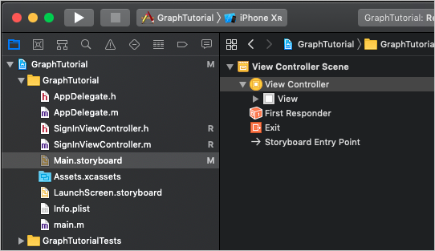
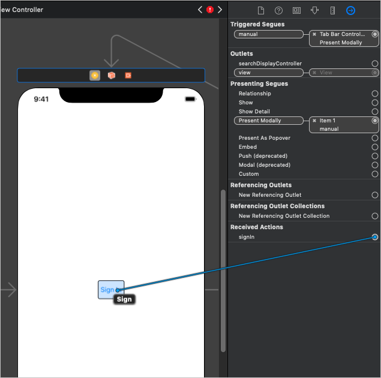
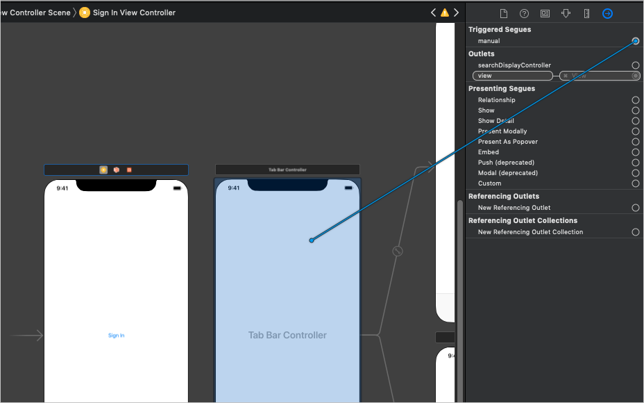

<!-- markdownlint-disable MD002 MD041 -->

<span data-ttu-id="33bcc-101">Начните с создания нового проекта SWIFT.</span><span class="sxs-lookup"><span data-stu-id="33bcc-101">Begin by creating a new Swift project.</span></span>

1. <span data-ttu-id="33bcc-102">Откройте Xcode.</span><span class="sxs-lookup"><span data-stu-id="33bcc-102">Open Xcode.</span></span> <span data-ttu-id="33bcc-103">В меню **файл** выберите пункт **создать**, а затем — **проект**.</span><span class="sxs-lookup"><span data-stu-id="33bcc-103">On the **File** menu, select **New**, then **Project**.</span></span>
1. <span data-ttu-id="33bcc-104">Выберите шаблон **приложения с одним представлением** и нажмите кнопку **Далее**.</span><span class="sxs-lookup"><span data-stu-id="33bcc-104">Choose the **Single View App** template and select **Next**.</span></span>

    

1. <span data-ttu-id="33bcc-106">Задайте для **имени продукта** значение `GraphTutorial` , а для **языка** значение **Цель — C**.</span><span class="sxs-lookup"><span data-stu-id="33bcc-106">Set the **Product Name** to `GraphTutorial` and the **Language** to **Objective-C**.</span></span>
1. <span data-ttu-id="33bcc-107">Заполните оставшиеся поля и нажмите кнопку **Далее**.</span><span class="sxs-lookup"><span data-stu-id="33bcc-107">Fill in the remaining fields and select **Next**.</span></span>
1. <span data-ttu-id="33bcc-108">Выберите расположение для проекта и нажмите кнопку **создать**.</span><span class="sxs-lookup"><span data-stu-id="33bcc-108">Choose a location for the project and select **Create**.</span></span>

## <a name="install-dependencies"></a><span data-ttu-id="33bcc-109">Установка зависимостей</span><span class="sxs-lookup"><span data-stu-id="33bcc-109">Install dependencies</span></span>

<span data-ttu-id="33bcc-110">Перед перемещением установите некоторые дополнительные зависимости, которые будут использоваться позже.</span><span class="sxs-lookup"><span data-stu-id="33bcc-110">Before moving on, install some additional dependencies that you will use later.</span></span>

- <span data-ttu-id="33bcc-111">[Библиотека проверки подлинности Microsoft (MSAL) для iOS](https://github.com/AzureAD/microsoft-authentication-library-for-objc) для проверки подлинности в Azure AD.</span><span class="sxs-lookup"><span data-stu-id="33bcc-111">[Microsoft Authentication Library (MSAL) for iOS](https://github.com/AzureAD/microsoft-authentication-library-for-objc) for authenticating to with Azure AD.</span></span>
- <span data-ttu-id="33bcc-112">[Пакет SDK Microsoft Graph для задания на языке C](https://github.com/microsoftgraph/msgraph-sdk-objc) для совершения вызовов в Microsoft Graph.</span><span class="sxs-lookup"><span data-stu-id="33bcc-112">[Microsoft Graph SDK for Objective C](https://github.com/microsoftgraph/msgraph-sdk-objc) for making calls to Microsoft Graph.</span></span>
- <span data-ttu-id="33bcc-113">[Пакет SDK моделей Microsoft Graph для задания с](https://github.com/microsoftgraph/msgraph-sdk-objc-models) строго типизированными объектами, представляющими ресурсы Microsoft Graph, такие как "Пользователи" или "события".</span><span class="sxs-lookup"><span data-stu-id="33bcc-113">[Microsoft Graph Models SDK for Objective C](https://github.com/microsoftgraph/msgraph-sdk-objc-models) for strongly-typed objects representing Microsoft Graph resources like users or events.</span></span>

1. <span data-ttu-id="33bcc-114">Выйдите из Xcode.</span><span class="sxs-lookup"><span data-stu-id="33bcc-114">Quit Xcode.</span></span>
1. <span data-ttu-id="33bcc-115">Откройте терминал и измените каталог на путь к проекту **графтуториал** .</span><span class="sxs-lookup"><span data-stu-id="33bcc-115">Open Terminal and change the directory to the location of your **GraphTutorial** project.</span></span>
1. <span data-ttu-id="33bcc-116">Выполните следующую команду, чтобы создать Podfile.</span><span class="sxs-lookup"><span data-stu-id="33bcc-116">Run the following command to create a Podfile.</span></span>

    ```Shell
    pod init
    ```

1. <span data-ttu-id="33bcc-117">Откройте Podfile и добавьте следующие строки сразу после `use_frameworks!` строки.</span><span class="sxs-lookup"><span data-stu-id="33bcc-117">Open the Podfile and add the following lines just after the `use_frameworks!` line.</span></span>

    ```Ruby
    pod 'MSAL', '~> 1.0.2'
    pod 'MSGraphClientSDK', ' ~> 1.0.0'
    pod 'MSGraphClientModels', '~> 1.3.0'
    ```

1. <span data-ttu-id="33bcc-118">Сохраните Podfile, а затем выполните следующую команду, чтобы установить зависимости.</span><span class="sxs-lookup"><span data-stu-id="33bcc-118">Save the Podfile, then run the following command to install the dependencies.</span></span>

    ```Shell
    pod install
    ```

1. <span data-ttu-id="33bcc-119">После выполнения команды откройте недавно созданный **графтуториал. xcworkspace** в Xcode.</span><span class="sxs-lookup"><span data-stu-id="33bcc-119">Once the command completes, open the newly created **GraphTutorial.xcworkspace** in Xcode.</span></span>

## <a name="design-the-app"></a><span data-ttu-id="33bcc-120">Проектирование приложения</span><span class="sxs-lookup"><span data-stu-id="33bcc-120">Design the app</span></span>

<span data-ttu-id="33bcc-121">В этом разделе вы создадите представления приложения: страница входа, навигатор панели вкладок, страница приветствия и страница календаря.</span><span class="sxs-lookup"><span data-stu-id="33bcc-121">In this section you will create the views for the app: a sign in page, a tab bar navigator, a welcome page, and a calendar page.</span></span> <span data-ttu-id="33bcc-122">Вы также создадите наложение индикатора действий.</span><span class="sxs-lookup"><span data-stu-id="33bcc-122">You'll also create an activity indicator overlay.</span></span>

### <a name="create-sign-in-page"></a><span data-ttu-id="33bcc-123">Страница "Создание входа"</span><span class="sxs-lookup"><span data-stu-id="33bcc-123">Create sign in page</span></span>

1. <span data-ttu-id="33bcc-124">Разверните папку **графтуториал** в Xcode, а затем выберите файл **ViewController. m** .</span><span class="sxs-lookup"><span data-stu-id="33bcc-124">Expand the **GraphTutorial** folder in Xcode, then select the **ViewController.m** file.</span></span>
1. <span data-ttu-id="33bcc-125">В **инспекторе файлов**измените **имя** файла на `SignInViewController.m`.</span><span class="sxs-lookup"><span data-stu-id="33bcc-125">In the **File Inspector**, change the **Name** of the file to `SignInViewController.m`.</span></span>

    

1. <span data-ttu-id="33bcc-127">Откройте **сигнинвиевконтроллер. m** и замените его содержимое приведенным ниже кодом.</span><span class="sxs-lookup"><span data-stu-id="33bcc-127">Open **SignInViewController.m** and replace its contents with the following code.</span></span>

    ```objc
    #import "SignInViewController.h"

    @interface SignInViewController ()

    @end

    @implementation SignInViewController

    - (void)viewDidLoad {
        [super viewDidLoad];
        // Do any additional setup after loading the view.
    }

    - (IBAction)signIn {
        [self performSegueWithIdentifier: @"userSignedIn" sender: nil];
    }
    @end
    ```

1. <span data-ttu-id="33bcc-128">Выберите файл **ViewController. h** .</span><span class="sxs-lookup"><span data-stu-id="33bcc-128">Select the **ViewController.h** file.</span></span>
1. <span data-ttu-id="33bcc-129">В **инспекторе файлов**измените **имя** файла на `SignInViewController.h`.</span><span class="sxs-lookup"><span data-stu-id="33bcc-129">In the **File Inspector**, change the **Name** of the file to `SignInViewController.h`.</span></span>
1. <span data-ttu-id="33bcc-130">Откройте **сигнинвиевконтроллер. h** и измените все экземпляры `ViewController` to. `SignInViewController`</span><span class="sxs-lookup"><span data-stu-id="33bcc-130">Open **SignInViewController.h** and change all instances of `ViewController` to `SignInViewController`.</span></span>

1. <span data-ttu-id="33bcc-131">Откройте файл **Main. Storyboard** .</span><span class="sxs-lookup"><span data-stu-id="33bcc-131">Open the **Main.storyboard** file.</span></span>
1. <span data-ttu-id="33bcc-132">Разверните панель **View Controller сцена**и выберите **View Controller (просмотреть контроллер**).</span><span class="sxs-lookup"><span data-stu-id="33bcc-132">Expand **View Controller Scene**, then select **View Controller**.</span></span>

    

1. <span data-ttu-id="33bcc-134">Выберите **инспектор удостоверений**, а затем измените раскрывающееся меню **Class** на **сигнинвиевконтроллер**.</span><span class="sxs-lookup"><span data-stu-id="33bcc-134">Select the **Identity Inspector**, then change the **Class** dropdown to **SignInViewController**.</span></span>

    

1. <span data-ttu-id="33bcc-136">Выберите **библиотеку**, а затем перетащите **кнопку** на **Контроллер входа в систему**.</span><span class="sxs-lookup"><span data-stu-id="33bcc-136">Select the **Library**, then drag a **Button** onto the **Sign In View Controller**.</span></span>

    

1. <span data-ttu-id="33bcc-138">Когда выбрана кнопка, выберите **инспектор атрибутов** и измените **название** кнопки на `Sign In`.</span><span class="sxs-lookup"><span data-stu-id="33bcc-138">With the button selected, select the **Attributes Inspector** and change the **Title** of the button to `Sign In`.</span></span>

    

1. <span data-ttu-id="33bcc-140">Выберите **Контроллер входа в систему**, а затем выберите **инспектор подключений**.</span><span class="sxs-lookup"><span data-stu-id="33bcc-140">Select the **Sign In View Controller**, then select the **Connections Inspector**.</span></span>
1. <span data-ttu-id="33bcc-141">В разделе **полученное действие**перетащите незаполненный круг рядом с кнопкой **войти** на кнопку.</span><span class="sxs-lookup"><span data-stu-id="33bcc-141">Under **Received Actions**, drag the unfilled circle next to **signIn** onto the button.</span></span> <span data-ttu-id="33bcc-142">Во всплывающем меню выберите пункт " **находящиеся вверх** ".</span><span class="sxs-lookup"><span data-stu-id="33bcc-142">Select **Touch Up Inside** on the pop-up menu.</span></span>

    

1. <span data-ttu-id="33bcc-144">В меню **Редактор** выберите **устранить проблемы с автоматическим макетом**, а затем выберите **добавить недостающие ограничения** под **все представления в контроллере входа в систему**.</span><span class="sxs-lookup"><span data-stu-id="33bcc-144">On the **Editor** menu, select **Resolve Auto Layout Issues**, then select **Add Missing Constraints** underneath **All Views in Sign In View Controller**.</span></span>

### <a name="create-tab-bar"></a><span data-ttu-id="33bcc-145">Создание панели вкладок</span><span class="sxs-lookup"><span data-stu-id="33bcc-145">Create tab bar</span></span>

1. <span data-ttu-id="33bcc-146">Выберите **библиотеку**, а затем перетащите **контроллер панели вкладок** на раскадровку.</span><span class="sxs-lookup"><span data-stu-id="33bcc-146">Select the **Library**, then drag a **Tab Bar Controller** onto the storyboard.</span></span>
1. <span data-ttu-id="33bcc-147">Выберите **Контроллер входа в систему**, а затем выберите **инспектор подключений**.</span><span class="sxs-lookup"><span data-stu-id="33bcc-147">Select the **Sign In View Controller**, then select the **Connections Inspector**.</span></span>
1. <span data-ttu-id="33bcc-148">В разделе **активированный сегуес**перетащите незаполненный кружок рядом с пунктом **вручную** на **контроллер панели вкладок** в раскадровке.</span><span class="sxs-lookup"><span data-stu-id="33bcc-148">Under **Triggered Segues**, drag the unfilled circle next to **manual** onto the **Tab Bar Controller** on the storyboard.</span></span> <span data-ttu-id="33bcc-149">Выберите пункт **Показывать модально** во всплывающем меню.</span><span class="sxs-lookup"><span data-stu-id="33bcc-149">Select **Present Modally** in the pop-up menu.</span></span>

    

1. <span data-ttu-id="33bcc-151">Выберите только что добавленные сегуе, а затем выберите **инспектор атрибутов**.</span><span class="sxs-lookup"><span data-stu-id="33bcc-151">Select the segue you just added, then select the **Attributes Inspector**.</span></span> <span data-ttu-id="33bcc-152">Задайте для \*\*\*\* `userSignedIn`поля идентификатора значение, а для параметра **Презентация** — в **полноэкранном режиме**.</span><span class="sxs-lookup"><span data-stu-id="33bcc-152">Set the **Identifier** field to `userSignedIn`, and set **Presentation** to **Full Screen**.</span></span>

    

1. <span data-ttu-id="33bcc-154">Выберите **сцену 1**, а затем выберите **инспектор подключений**.</span><span class="sxs-lookup"><span data-stu-id="33bcc-154">Select the **Item 1 Scene**, then select the **Connections Inspector**.</span></span>
1. <span data-ttu-id="33bcc-155">В разделе **запущенные сегуес**перетащите незаполненный кружок рядом с пунктом " **вручную** " на **Контроллер входа** на экран раскадровки.</span><span class="sxs-lookup"><span data-stu-id="33bcc-155">Under **Triggered Segues**, drag the unfilled circle next to **manual** onto the **Sign In View Controller** on the storyboard.</span></span> <span data-ttu-id="33bcc-156">Выберите пункт **Показывать модально** во всплывающем меню.</span><span class="sxs-lookup"><span data-stu-id="33bcc-156">Select **Present Modally** in the pop-up menu.</span></span>
1. <span data-ttu-id="33bcc-157">Выберите только что добавленные сегуе, а затем выберите **инспектор атрибутов**.</span><span class="sxs-lookup"><span data-stu-id="33bcc-157">Select the segue you just added, then select the **Attributes Inspector**.</span></span> <span data-ttu-id="33bcc-158">Задайте для \*\*\*\* `userSignedOut`поля идентификатора значение, а для параметра **Презентация** — в **полноэкранном режиме**.</span><span class="sxs-lookup"><span data-stu-id="33bcc-158">Set the **Identifier** field to `userSignedOut`, and set **Presentation** to **Full Screen**.</span></span>

### <a name="create-welcome-page"></a><span data-ttu-id="33bcc-159">Создание страницы приветствия</span><span class="sxs-lookup"><span data-stu-id="33bcc-159">Create welcome page</span></span>

1. <span data-ttu-id="33bcc-160">Выберите файл **Assets. кскассетс** .</span><span class="sxs-lookup"><span data-stu-id="33bcc-160">Select the **Assets.xcassets** file.</span></span>
1. <span data-ttu-id="33bcc-161">В меню **Редактор** выберите **Добавить ресурсы**, а затем — **новый набор изображений**.</span><span class="sxs-lookup"><span data-stu-id="33bcc-161">On the **Editor** menu, select **Add Assets**, then **New Image Set**.</span></span>
1. <span data-ttu-id="33bcc-162">Выберите новый ресурс **изображения** и используйте **инспектор атрибутов** , чтобы присвоить \*\*\*\* ему имя `DefaultUserPhoto`.</span><span class="sxs-lookup"><span data-stu-id="33bcc-162">Select the new **Image** asset and use the **Attribute Inspector** to set its **Name** to `DefaultUserPhoto`.</span></span>
1. <span data-ttu-id="33bcc-163">Добавьте любое изображение, которое будет использоваться как фотография профиля пользователя по умолчанию.</span><span class="sxs-lookup"><span data-stu-id="33bcc-163">Add any image you like to serve as a default user profile photo.</span></span>

    

1. <span data-ttu-id="33bcc-165">Создайте новый файл **класса Touch Cocoa** в папке **графтуториал** с именем `WelcomeViewController`.</span><span class="sxs-lookup"><span data-stu-id="33bcc-165">Create a new **Cocoa Touch Class** file in the **GraphTutorial** folder named `WelcomeViewController`.</span></span> <span data-ttu-id="33bcc-166">Выберите **уивиевконтроллер** в **подклассе** поля.</span><span class="sxs-lookup"><span data-stu-id="33bcc-166">Choose **UIViewController** in the **Subclass of** field.</span></span>
1. <span data-ttu-id="33bcc-167">Откройте **велкомевиевконтроллер. h** и добавьте следующий код в `@interface` объявление.</span><span class="sxs-lookup"><span data-stu-id="33bcc-167">Open **WelcomeViewController.h** and add the following code inside the `@interface` declaration.</span></span>

    ```objc
    @property (nonatomic) IBOutlet UIImageView *userProfilePhoto;
    @property (nonatomic) IBOutlet UILabel *userDisplayName;
    @property (nonatomic) IBOutlet UILabel *userEmail;
    ```

1. <span data-ttu-id="33bcc-168">Откройте **велкомевиевконтроллер. m** и замените его содержимое приведенным ниже кодом.</span><span class="sxs-lookup"><span data-stu-id="33bcc-168">Open **WelcomeViewController.m** and replace its contents with the following code.</span></span>

    ```objc
    #import "WelcomeViewController.h"

    @interface WelcomeViewController ()

    @end

    @implementation WelcomeViewController

    - (void)viewDidLoad {
        [super viewDidLoad];
        // Do any additional setup after loading the view.

        // TEMPORARY
        self.userProfilePhoto.image = [UIImage imageNamed:@"DefaultUserPhoto"];
        self.userDisplayName.text = @"Default User";
        [self.userDisplayName sizeToFit];
        self.userEmail.text = @"default@contoso.com";
        [self.userEmail sizeToFit];
    }

    - (IBAction)signOut {
        [self performSegueWithIdentifier: @"userSignedOut" sender: nil];
    }

    @end
    ```

1. <span data-ttu-id="33bcc-169">Откройте **главное. раскадровка**.</span><span class="sxs-lookup"><span data-stu-id="33bcc-169">Open **Main.storyboard**.</span></span> <span data-ttu-id="33bcc-170">Выберите **сцену 1**, а затем выберите **инспектор удостоверений**.</span><span class="sxs-lookup"><span data-stu-id="33bcc-170">Select the **Item 1 Scene**, then select the **Identity Inspector**.</span></span> <span data-ttu-id="33bcc-171">Измените значение свойства **Class** на **велкомевиевконтроллер**.</span><span class="sxs-lookup"><span data-stu-id="33bcc-171">Change the **Class** value to **WelcomeViewController**.</span></span>
1. <span data-ttu-id="33bcc-172">С помощью **библиотеки**добавьте указанные ниже элементы в сцену " **элемент 1**".</span><span class="sxs-lookup"><span data-stu-id="33bcc-172">Using the **Library**, add the following items to the **Item 1 Scene**.</span></span>

    - <span data-ttu-id="33bcc-173">Одно **представление изображений**</span><span class="sxs-lookup"><span data-stu-id="33bcc-173">One **Image View**</span></span>
    - <span data-ttu-id="33bcc-174">Две **метки**</span><span class="sxs-lookup"><span data-stu-id="33bcc-174">Two **Labels**</span></span>
    - <span data-ttu-id="33bcc-175">Одна **кнопка**</span><span class="sxs-lookup"><span data-stu-id="33bcc-175">One **Button**</span></span>

1. <span data-ttu-id="33bcc-176">Выберите представление изображения, а затем выберите **Инспектор размеров**.</span><span class="sxs-lookup"><span data-stu-id="33bcc-176">Select the image view, then select the **Size Inspector**.</span></span>
1. <span data-ttu-id="33bcc-177">Задайте **ширину** и **высоту** 196.</span><span class="sxs-lookup"><span data-stu-id="33bcc-177">Set the **Width** and **Height** to 196.</span></span>
1. <span data-ttu-id="33bcc-178">Выберите вторую метку, а затем щелкните **инспектор атрибутов**.</span><span class="sxs-lookup"><span data-stu-id="33bcc-178">Select the second label, then select the **Attributes Inspector**.</span></span>
1. <span data-ttu-id="33bcc-179">Измените **Цвет** на **темный серый цвет**и замените **Шрифт** на **системный 12,0**.</span><span class="sxs-lookup"><span data-stu-id="33bcc-179">Change the **Color** to **Dark Gray Color**, and change the **Font** to **System 12.0**.</span></span>
1. <span data-ttu-id="33bcc-180">Нажмите кнопку, а затем выберите **инспектор атрибутов**.</span><span class="sxs-lookup"><span data-stu-id="33bcc-180">Select the button, then select the **Attributes Inspector**.</span></span>
1. <span data-ttu-id="33bcc-181">Измените **заголовок** на `Sign Out`.</span><span class="sxs-lookup"><span data-stu-id="33bcc-181">Change the **Title** to `Sign Out`.</span></span>
1. <span data-ttu-id="33bcc-182">С помощью **инспектора подключений**создайте следующие подключения.</span><span class="sxs-lookup"><span data-stu-id="33bcc-182">Using the **Connections Inspector**, make the following connections.</span></span>

    - <span data-ttu-id="33bcc-183">Свяжите розетку **userDisplayName** с первой меткой.</span><span class="sxs-lookup"><span data-stu-id="33bcc-183">Link the **userDisplayName** outlet to the first label.</span></span>
    - <span data-ttu-id="33bcc-184">Свяжите розетку **userEmail** с второй меткой.</span><span class="sxs-lookup"><span data-stu-id="33bcc-184">Link the **userEmail** outlet to the second label.</span></span>
    - <span data-ttu-id="33bcc-185">Свяжите розетку **усерпрофилефото** с представлением изображения.</span><span class="sxs-lookup"><span data-stu-id="33bcc-185">Link the **userProfilePhoto** outlet to the image view.</span></span>
    - <span data-ttu-id="33bcc-186">Связывание действия, полученного при **выйдите** , с помощью кнопки **вверх**на кнопке.</span><span class="sxs-lookup"><span data-stu-id="33bcc-186">Link the **signOut** received action to the button's **Touch Up Inside**.</span></span>

1. <span data-ttu-id="33bcc-187">Выберите элемент Панель вкладок в нижней части сцены, а затем выберите **инспектор атрибутов**.</span><span class="sxs-lookup"><span data-stu-id="33bcc-187">Select the tab bar item at the bottom of the scene, then select the **Attributes Inspector**.</span></span> <span data-ttu-id="33bcc-188">Измените **заголовок** на `Me`.</span><span class="sxs-lookup"><span data-stu-id="33bcc-188">Change the **Title** to `Me`.</span></span>
1. <span data-ttu-id="33bcc-189">В меню **Редактор** выберите команду **устранить проблемы с автоматическим макетом**, а затем выберите **добавить недостающие ограничения** **в все представления на контроллере приветствия**.</span><span class="sxs-lookup"><span data-stu-id="33bcc-189">On the **Editor** menu, select **Resolve Auto Layout Issues**, then select **Add Missing Constraints** underneath **All Views in Welcome View Controller**.</span></span>

<span data-ttu-id="33bcc-190">По завершении настройки сцена приветствия должен выглядеть так, как показано ниже.</span><span class="sxs-lookup"><span data-stu-id="33bcc-190">The welcome scene should look similar to this once you're done.</span></span>


### <a name="create-calendar-page"></a><span data-ttu-id="33bcc-192">Создание страницы календаря</span><span class="sxs-lookup"><span data-stu-id="33bcc-192">Create calendar page</span></span>

1. <span data-ttu-id="33bcc-193">Создайте новый файл **класса Touch Cocoa** в папке **графтуториал** с именем `CalendarViewController`.</span><span class="sxs-lookup"><span data-stu-id="33bcc-193">Create a new **Cocoa Touch Class** file in the **GraphTutorial** folder named `CalendarViewController`.</span></span> <span data-ttu-id="33bcc-194">Выберите **уивиевконтроллер** в **подклассе** поля.</span><span class="sxs-lookup"><span data-stu-id="33bcc-194">Choose **UIViewController** in the **Subclass of** field.</span></span>
1. <span data-ttu-id="33bcc-195">Откройте **календарвиевконтроллер. h** и добавьте следующий код в `@interface` объявление.</span><span class="sxs-lookup"><span data-stu-id="33bcc-195">Open **CalendarViewController.h** and add the following code inside the `@interface` declaration.</span></span>

    ```objc
    @property (nonatomic) IBOutlet UITextView *calendarJSON;
    ```

1. <span data-ttu-id="33bcc-196">Откройте **календарвиевконтроллер. m** и замените его содержимое приведенным ниже кодом.</span><span class="sxs-lookup"><span data-stu-id="33bcc-196">Open **CalendarViewController.m** and replace its contents with the following code.</span></span>

    ```objc
    #import "CalendarViewController.h"

    @interface CalendarViewController ()

    @end

    @implementation CalendarViewController

    - (void)viewDidLoad {
        [super viewDidLoad];
        // Do any additional setup after loading the view.

        // TEMPORARY
        self.calendarJSON.text = @"Calendar";
        [self.calendarJSON sizeToFit];
    }

    @end
    ```

1. <span data-ttu-id="33bcc-197">Откройте **главное. раскадровка**.</span><span class="sxs-lookup"><span data-stu-id="33bcc-197">Open **Main.storyboard**.</span></span> <span data-ttu-id="33bcc-198">Выберите **сцену 2 элемента 2**, а затем выберите **инспектор удостоверений**.</span><span class="sxs-lookup"><span data-stu-id="33bcc-198">Select the **Item 2 Scene**, then select the **Identity Inspector**.</span></span> <span data-ttu-id="33bcc-199">Измените значение свойства **Class** на **календарвиевконтроллер**.</span><span class="sxs-lookup"><span data-stu-id="33bcc-199">Change the **Class** value to **CalendarViewController**.</span></span>
1. <span data-ttu-id="33bcc-200">С помощью **библиотеки**добавьте **текстовое представление** в **сцену "элемент 2**".</span><span class="sxs-lookup"><span data-stu-id="33bcc-200">Using the **Library**, add a **Text View** to the **Item 2 Scene**.</span></span>
1. <span data-ttu-id="33bcc-201">Выберите только что добавленное текстовое представление.</span><span class="sxs-lookup"><span data-stu-id="33bcc-201">Select the text view you just added.</span></span> <span data-ttu-id="33bcc-202">В **редакторе**выберите **внедрить в**, а затем **прокрутить представление**.</span><span class="sxs-lookup"><span data-stu-id="33bcc-202">On the **Editor**, choose **Embed In**, then **Scroll View**.</span></span>
1. <span data-ttu-id="33bcc-203">С помощью **инспектора подключений**Подключите розетку **календаржсон** к текстовому представлению.</span><span class="sxs-lookup"><span data-stu-id="33bcc-203">Using the **Connections Inspector**, connect the **calendarJSON** outlet to the text view.</span></span>
1. 1. <span data-ttu-id="33bcc-204">Выберите элемент Панель вкладок в нижней части сцены, а затем выберите **инспектор атрибутов**.</span><span class="sxs-lookup"><span data-stu-id="33bcc-204">Select the tab bar item at the bottom of the scene, then select the **Attributes Inspector**.</span></span> <span data-ttu-id="33bcc-205">Измените **заголовок** на `Calendar`.</span><span class="sxs-lookup"><span data-stu-id="33bcc-205">Change the **Title** to `Calendar`.</span></span>
1. <span data-ttu-id="33bcc-206">В меню **Редактор** выберите команду **устранить проблемы с автоматическим макетом**, а затем выберите **добавить недостающие ограничения** **в все представления на контроллере приветствия**.</span><span class="sxs-lookup"><span data-stu-id="33bcc-206">On the **Editor** menu, select **Resolve Auto Layout Issues**, then select **Add Missing Constraints** underneath **All Views in Welcome View Controller**.</span></span>

<span data-ttu-id="33bcc-207">По завершении настройки сцена должна выглядеть так, как показано ниже.</span><span class="sxs-lookup"><span data-stu-id="33bcc-207">The calendar scene should look similar to this once you're done.</span></span>


### <a name="create-activity-indicator"></a><span data-ttu-id="33bcc-209">Создание индикатора активности</span><span class="sxs-lookup"><span data-stu-id="33bcc-209">Create activity indicator</span></span>

1. <span data-ttu-id="33bcc-210">Создайте новый файл **класса Touch Cocoa** в папке **графтуториал** с именем `SpinnerViewController`.</span><span class="sxs-lookup"><span data-stu-id="33bcc-210">Create a new **Cocoa Touch Class** file in the **GraphTutorial** folder named `SpinnerViewController`.</span></span> <span data-ttu-id="33bcc-211">Выберите **уивиевконтроллер** в **подклассе** поля.</span><span class="sxs-lookup"><span data-stu-id="33bcc-211">Choose **UIViewController** in the **Subclass of** field.</span></span>
1. <span data-ttu-id="33bcc-212">Откройте **спиннервиевконтроллер. h** и добавьте следующий код в `@interface` объявление.</span><span class="sxs-lookup"><span data-stu-id="33bcc-212">Open **SpinnerViewController.h** and add the following code inside the `@interface` declaration.</span></span>

    ```objc
    - (void) startWithContainer:(UIViewController*) container;
    - (void) stop;
    ```

1. <span data-ttu-id="33bcc-213">Откройте **спиннервиевконтроллер. m** и замените его содержимое приведенным ниже кодом.</span><span class="sxs-lookup"><span data-stu-id="33bcc-213">Open **SpinnerViewController.m** and replace its contents with the following code.</span></span>

    ```objc
    #import "SpinnerViewController.h"

    @interface SpinnerViewController ()
    @property (nonatomic) UIActivityIndicatorView* spinner;
    @end

    @implementation SpinnerViewController

    - (void)viewDidLoad {
        [super viewDidLoad];

        _spinner = [[UIActivityIndicatorView alloc] initWithActivityIndicatorStyle:
                    UIActivityIndicatorViewStyleWhiteLarge];

        self.view.backgroundColor = [UIColor colorWithWhite:0 alpha:0.7];
        [self.view addSubview:_spinner];

        _spinner.translatesAutoresizingMaskIntoConstraints = false;
        [_spinner startAnimating];

        [_spinner.centerXAnchor constraintEqualToAnchor:self.view.centerXAnchor].active = true;
        [_spinner.centerYAnchor constraintEqualToAnchor:self.view.centerYAnchor].active = true;
    }

    - (void) startWithContainer:(UIViewController *)container {
        [container addChildViewController:self];
        self.view.frame = container.view.frame;
        [container.view addSubview:self.view];
        [self didMoveToParentViewController:container];
    }

    - (void) stop {
        [self willMoveToParentViewController:nil];
        [self.view removeFromSuperview];
        [self removeFromParentViewController];
    }

    @end
    ```

## <a name="test-the-app"></a><span data-ttu-id="33bcc-214">Тестирование приложения</span><span class="sxs-lookup"><span data-stu-id="33bcc-214">Test the app</span></span>

<span data-ttu-id="33bcc-215">Сохраните изменения и запустите приложение.</span><span class="sxs-lookup"><span data-stu-id="33bcc-215">Save your changes and launch the app.</span></span> <span data-ttu-id="33bcc-216">Вы должны иметь возможность перемещаться между экранами с помощью кнопок **входа** и **выхода,** а также с помощью панели вкладок.</span><span class="sxs-lookup"><span data-stu-id="33bcc-216">You should be able to move between the screens using the **Sign In** and **Sign Out** buttons and the tab bar.</span></span>


