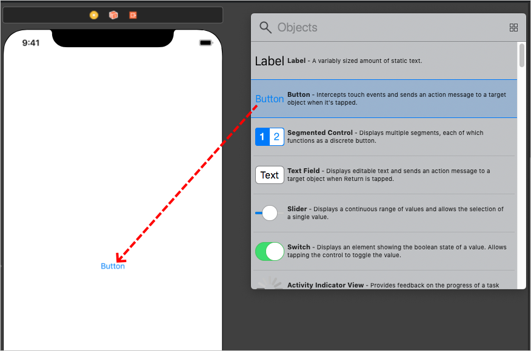
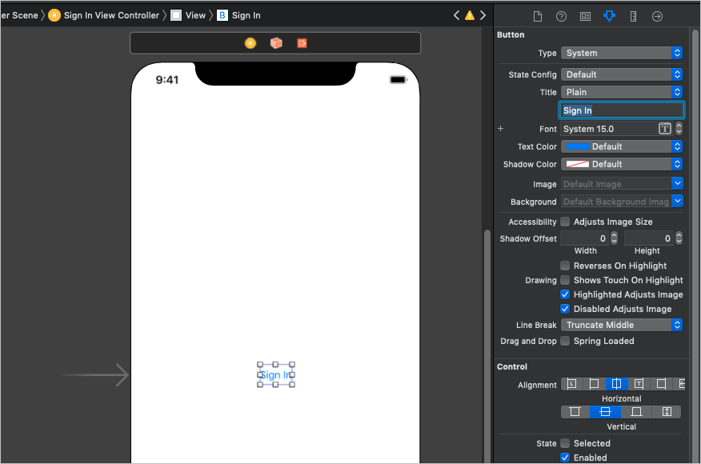
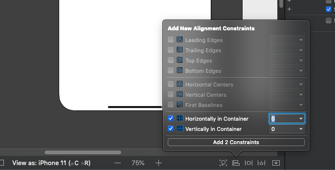
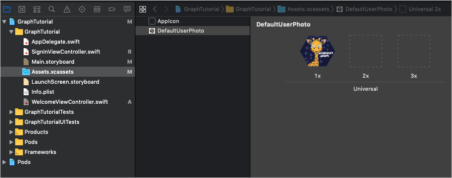
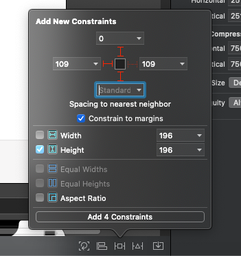

<!-- markdownlint-disable MD002 MD041 -->

<span data-ttu-id="cecbf-101">Начните с создания нового проекта SWIFT.</span><span class="sxs-lookup"><span data-stu-id="cecbf-101">Begin by creating a new Swift project.</span></span>

1. <span data-ttu-id="cecbf-102">Откройте Xcode.</span><span class="sxs-lookup"><span data-stu-id="cecbf-102">Open Xcode.</span></span> <span data-ttu-id="cecbf-103">В меню **файл** выберите пункт **создать**, а затем — **проект**.</span><span class="sxs-lookup"><span data-stu-id="cecbf-103">On the **File** menu, select **New**, then **Project**.</span></span>
1. <span data-ttu-id="cecbf-104">Выберите шаблон **приложения с одним представлением** и нажмите кнопку **Далее**.</span><span class="sxs-lookup"><span data-stu-id="cecbf-104">Choose the **Single View App** template and select **Next**.</span></span>

    

1. <span data-ttu-id="cecbf-106">Задайте для **имени продукта** значение `GraphTutorial` , а для **языка** значение **Цель — C**.</span><span class="sxs-lookup"><span data-stu-id="cecbf-106">Set the **Product Name** to `GraphTutorial` and the **Language** to **Objective-C**.</span></span>
1. <span data-ttu-id="cecbf-107">Заполните оставшиеся поля и нажмите кнопку **Далее**.</span><span class="sxs-lookup"><span data-stu-id="cecbf-107">Fill in the remaining fields and select **Next**.</span></span>
1. <span data-ttu-id="cecbf-108">Выберите расположение для проекта и нажмите кнопку **создать**.</span><span class="sxs-lookup"><span data-stu-id="cecbf-108">Choose a location for the project and select **Create**.</span></span>

## <a name="install-dependencies"></a><span data-ttu-id="cecbf-109">Установка зависимостей</span><span class="sxs-lookup"><span data-stu-id="cecbf-109">Install dependencies</span></span>

<span data-ttu-id="cecbf-110">Перед перемещением установите некоторые дополнительные зависимости, которые будут использоваться позже.</span><span class="sxs-lookup"><span data-stu-id="cecbf-110">Before moving on, install some additional dependencies that you will use later.</span></span>

- <span data-ttu-id="cecbf-111">[Библиотека проверки подлинности Microsoft (MSAL) для iOS](https://github.com/AzureAD/microsoft-authentication-library-for-objc) для проверки подлинности в Azure AD.</span><span class="sxs-lookup"><span data-stu-id="cecbf-111">[Microsoft Authentication Library (MSAL) for iOS](https://github.com/AzureAD/microsoft-authentication-library-for-objc) for authenticating to with Azure AD.</span></span>
- <span data-ttu-id="cecbf-112">[Пакет SDK Microsoft Graph для задания на языке C](https://github.com/microsoftgraph/msgraph-sdk-objc) для совершения вызовов в Microsoft Graph.</span><span class="sxs-lookup"><span data-stu-id="cecbf-112">[Microsoft Graph SDK for Objective C](https://github.com/microsoftgraph/msgraph-sdk-objc) for making calls to Microsoft Graph.</span></span>
- <span data-ttu-id="cecbf-113">[Пакет SDK моделей Microsoft Graph для задания с](https://github.com/microsoftgraph/msgraph-sdk-objc-models) строго типизированными объектами, представляющими ресурсы Microsoft Graph, такие как "Пользователи" или "события".</span><span class="sxs-lookup"><span data-stu-id="cecbf-113">[Microsoft Graph Models SDK for Objective C](https://github.com/microsoftgraph/msgraph-sdk-objc-models) for strongly-typed objects representing Microsoft Graph resources like users or events.</span></span>

1. <span data-ttu-id="cecbf-114">Выйдите из Xcode.</span><span class="sxs-lookup"><span data-stu-id="cecbf-114">Quit Xcode.</span></span>
1. <span data-ttu-id="cecbf-115">Откройте терминал и измените каталог на путь к проекту **графтуториал** .</span><span class="sxs-lookup"><span data-stu-id="cecbf-115">Open Terminal and change the directory to the location of your **GraphTutorial** project.</span></span>
1. <span data-ttu-id="cecbf-116">Выполните следующую команду, чтобы создать Podfile.</span><span class="sxs-lookup"><span data-stu-id="cecbf-116">Run the following command to create a Podfile.</span></span>

    ```Shell
    pod init
    ```

1. <span data-ttu-id="cecbf-117">Откройте Podfile и добавьте следующие строки сразу после `use_frameworks!` строки.</span><span class="sxs-lookup"><span data-stu-id="cecbf-117">Open the Podfile and add the following lines just after the `use_frameworks!` line.</span></span>

    ```Ruby
    pod 'MSAL', '~> 1.1.1'
    pod 'MSGraphClientSDK', ' ~> 1.0.0'
    pod 'MSGraphClientModels', '~> 1.3.0'
    ```

1. <span data-ttu-id="cecbf-118">Сохраните Podfile, а затем выполните следующую команду, чтобы установить зависимости.</span><span class="sxs-lookup"><span data-stu-id="cecbf-118">Save the Podfile, then run the following command to install the dependencies.</span></span>

    ```Shell
    pod install
    ```

1. <span data-ttu-id="cecbf-119">После выполнения команды откройте недавно созданный **графтуториал. xcworkspace** в Xcode.</span><span class="sxs-lookup"><span data-stu-id="cecbf-119">Once the command completes, open the newly created **GraphTutorial.xcworkspace** in Xcode.</span></span>

## <a name="design-the-app"></a><span data-ttu-id="cecbf-120">Проектирование приложения</span><span class="sxs-lookup"><span data-stu-id="cecbf-120">Design the app</span></span>

<span data-ttu-id="cecbf-121">В этом разделе вы создадите представления приложения: страница входа, навигатор панели вкладок, страница приветствия и страница календаря.</span><span class="sxs-lookup"><span data-stu-id="cecbf-121">In this section you will create the views for the app: a sign in page, a tab bar navigator, a welcome page, and a calendar page.</span></span> <span data-ttu-id="cecbf-122">Вы также создадите наложение индикатора действий.</span><span class="sxs-lookup"><span data-stu-id="cecbf-122">You'll also create an activity indicator overlay.</span></span>

### <a name="create-sign-in-page"></a><span data-ttu-id="cecbf-123">Страница "Создание входа"</span><span class="sxs-lookup"><span data-stu-id="cecbf-123">Create sign in page</span></span>

1. <span data-ttu-id="cecbf-124">Разверните папку **графтуториал** в Xcode, а затем выберите файл **ViewController. m** .</span><span class="sxs-lookup"><span data-stu-id="cecbf-124">Expand the **GraphTutorial** folder in Xcode, then select the **ViewController.m** file.</span></span>
1. <span data-ttu-id="cecbf-125">В **инспекторе файлов**измените **имя** файла на `SignInViewController.m`.</span><span class="sxs-lookup"><span data-stu-id="cecbf-125">In the **File Inspector**, change the **Name** of the file to `SignInViewController.m`.</span></span>

    

1. <span data-ttu-id="cecbf-127">Откройте **сигнинвиевконтроллер. m** и замените его содержимое приведенным ниже кодом.</span><span class="sxs-lookup"><span data-stu-id="cecbf-127">Open **SignInViewController.m** and replace its contents with the following code.</span></span>

    ```objc
    #import "SignInViewController.h"

    @interface SignInViewController ()

    @end

    @implementation SignInViewController

    - (void)viewDidLoad {
        [super viewDidLoad];
        // Do any additional setup after loading the view.
    }

    - (IBAction)signIn {
        [self performSegueWithIdentifier: @"userSignedIn" sender: nil];
    }
    @end
    ```

1. <span data-ttu-id="cecbf-128">Выберите файл **ViewController. h** .</span><span class="sxs-lookup"><span data-stu-id="cecbf-128">Select the **ViewController.h** file.</span></span>
1. <span data-ttu-id="cecbf-129">В **инспекторе файлов**измените **имя** файла на `SignInViewController.h`.</span><span class="sxs-lookup"><span data-stu-id="cecbf-129">In the **File Inspector**, change the **Name** of the file to `SignInViewController.h`.</span></span>
1. <span data-ttu-id="cecbf-130">Откройте **сигнинвиевконтроллер. h** и измените все экземпляры `ViewController` to. `SignInViewController`</span><span class="sxs-lookup"><span data-stu-id="cecbf-130">Open **SignInViewController.h** and change all instances of `ViewController` to `SignInViewController`.</span></span>

1. <span data-ttu-id="cecbf-131">Откройте файл **Main. Storyboard** .</span><span class="sxs-lookup"><span data-stu-id="cecbf-131">Open the **Main.storyboard** file.</span></span>
1. <span data-ttu-id="cecbf-132">Разверните панель **View Controller сцена**и выберите **View Controller (просмотреть контроллер**).</span><span class="sxs-lookup"><span data-stu-id="cecbf-132">Expand **View Controller Scene**, then select **View Controller**.</span></span>

    

1. <span data-ttu-id="cecbf-134">Выберите **инспектор удостоверений**, а затем измените раскрывающееся меню **Class** на **сигнинвиевконтроллер**.</span><span class="sxs-lookup"><span data-stu-id="cecbf-134">Select the **Identity Inspector**, then change the **Class** dropdown to **SignInViewController**.</span></span>

    

1. <span data-ttu-id="cecbf-136">Выберите **библиотеку**, а затем перетащите **кнопку** на **Контроллер входа в систему**.</span><span class="sxs-lookup"><span data-stu-id="cecbf-136">Select the **Library**, then drag a **Button** onto the **Sign In View Controller**.</span></span>

    

1. <span data-ttu-id="cecbf-138">Когда выбрана кнопка, выберите **инспектор атрибутов** и измените **название** кнопки на `Sign In`.</span><span class="sxs-lookup"><span data-stu-id="cecbf-138">With the button selected, select the **Attributes Inspector** and change the **Title** of the button to `Sign In`.</span></span>

    

1. <span data-ttu-id="cecbf-140">Выполнив выбранную кнопку, нажмите кнопку **Выровнять** в нижней части раскадровки.</span><span class="sxs-lookup"><span data-stu-id="cecbf-140">With the button selected, select the **Align** button at the bottom of the storyboard.</span></span> <span data-ttu-id="cecbf-141">Выберите **горизонтально в контейнере** и **вертикально в** ограничениях контейнера, оставьте значения 0, а затем выберите **Добавить 2 ограничения**.</span><span class="sxs-lookup"><span data-stu-id="cecbf-141">Select both the **Horizontally in container** and **Vertically in container** constraints, leave their values as 0, then select **Add 2 constraints**.</span></span>

    

1. <span data-ttu-id="cecbf-143">Выберите **Контроллер входа в систему**, а затем выберите **инспектор подключений**.</span><span class="sxs-lookup"><span data-stu-id="cecbf-143">Select the **Sign In View Controller**, then select the **Connections Inspector**.</span></span>
1. <span data-ttu-id="cecbf-144">В разделе **полученное действие**перетащите незаполненный круг рядом с кнопкой **войти** на кнопку.</span><span class="sxs-lookup"><span data-stu-id="cecbf-144">Under **Received Actions**, drag the unfilled circle next to **signIn** onto the button.</span></span> <span data-ttu-id="cecbf-145">Во всплывающем меню выберите пункт " **находящиеся вверх** ".</span><span class="sxs-lookup"><span data-stu-id="cecbf-145">Select **Touch Up Inside** on the pop-up menu.</span></span>

    

### <a name="create-tab-bar"></a><span data-ttu-id="cecbf-147">Создание панели вкладок</span><span class="sxs-lookup"><span data-stu-id="cecbf-147">Create tab bar</span></span>

1. <span data-ttu-id="cecbf-148">Выберите **библиотеку**, а затем перетащите **контроллер панели вкладок** на раскадровку.</span><span class="sxs-lookup"><span data-stu-id="cecbf-148">Select the **Library**, then drag a **Tab Bar Controller** onto the storyboard.</span></span>
1. <span data-ttu-id="cecbf-149">Выберите **Контроллер входа в систему**, а затем выберите **инспектор подключений**.</span><span class="sxs-lookup"><span data-stu-id="cecbf-149">Select the **Sign In View Controller**, then select the **Connections Inspector**.</span></span>
1. <span data-ttu-id="cecbf-150">В разделе **активированный сегуес**перетащите незаполненный кружок рядом с пунктом **вручную** на **контроллер панели вкладок** в раскадровке.</span><span class="sxs-lookup"><span data-stu-id="cecbf-150">Under **Triggered Segues**, drag the unfilled circle next to **manual** onto the **Tab Bar Controller** on the storyboard.</span></span> <span data-ttu-id="cecbf-151">Выберите пункт **Показывать модально** во всплывающем меню.</span><span class="sxs-lookup"><span data-stu-id="cecbf-151">Select **Present Modally** in the pop-up menu.</span></span>

    

1. <span data-ttu-id="cecbf-153">Выберите только что добавленные сегуе, а затем выберите **инспектор атрибутов**.</span><span class="sxs-lookup"><span data-stu-id="cecbf-153">Select the segue you just added, then select the **Attributes Inspector**.</span></span> <span data-ttu-id="cecbf-154">Задайте для **Identifier** `userSignedIn`поля идентификатора значение, а для параметра **Презентация** — в **полноэкранном режиме**.</span><span class="sxs-lookup"><span data-stu-id="cecbf-154">Set the **Identifier** field to `userSignedIn`, and set **Presentation** to **Full Screen**.</span></span>

    

1. <span data-ttu-id="cecbf-156">Выберите **сцену 1**, а затем выберите **инспектор подключений**.</span><span class="sxs-lookup"><span data-stu-id="cecbf-156">Select the **Item 1 Scene**, then select the **Connections Inspector**.</span></span>
1. <span data-ttu-id="cecbf-157">В разделе **запущенные сегуес**перетащите незаполненный кружок рядом с пунктом " **вручную** " на **Контроллер входа** на экран раскадровки.</span><span class="sxs-lookup"><span data-stu-id="cecbf-157">Under **Triggered Segues**, drag the unfilled circle next to **manual** onto the **Sign In View Controller** on the storyboard.</span></span> <span data-ttu-id="cecbf-158">Выберите пункт **Показывать модально** во всплывающем меню.</span><span class="sxs-lookup"><span data-stu-id="cecbf-158">Select **Present Modally** in the pop-up menu.</span></span>
1. <span data-ttu-id="cecbf-159">Выберите только что добавленные сегуе, а затем выберите **инспектор атрибутов**.</span><span class="sxs-lookup"><span data-stu-id="cecbf-159">Select the segue you just added, then select the **Attributes Inspector**.</span></span> <span data-ttu-id="cecbf-160">Задайте для **Identifier** `userSignedOut`поля идентификатора значение, а для параметра **Презентация** — в **полноэкранном режиме**.</span><span class="sxs-lookup"><span data-stu-id="cecbf-160">Set the **Identifier** field to `userSignedOut`, and set **Presentation** to **Full Screen**.</span></span>

### <a name="create-welcome-page"></a><span data-ttu-id="cecbf-161">Создание страницы приветствия</span><span class="sxs-lookup"><span data-stu-id="cecbf-161">Create welcome page</span></span>

1. <span data-ttu-id="cecbf-162">Выберите файл **Assets. кскассетс** .</span><span class="sxs-lookup"><span data-stu-id="cecbf-162">Select the **Assets.xcassets** file.</span></span>
1. <span data-ttu-id="cecbf-163">В меню **Редактор** выберите **Добавить ресурсы**, а затем — **новый набор изображений**.</span><span class="sxs-lookup"><span data-stu-id="cecbf-163">On the **Editor** menu, select **Add Assets**, then **New Image Set**.</span></span>
1. <span data-ttu-id="cecbf-164">Выберите новый ресурс **изображения** и используйте **инспектор атрибутов** , чтобы присвоить **Name** ему имя `DefaultUserPhoto`.</span><span class="sxs-lookup"><span data-stu-id="cecbf-164">Select the new **Image** asset and use the **Attribute Inspector** to set its **Name** to `DefaultUserPhoto`.</span></span>
1. <span data-ttu-id="cecbf-165">Добавьте любое изображение, которое будет использоваться как фотография профиля пользователя по умолчанию.</span><span class="sxs-lookup"><span data-stu-id="cecbf-165">Add any image you like to serve as a default user profile photo.</span></span>

    

1. <span data-ttu-id="cecbf-167">Создайте новый файл **класса Touch Cocoa** в папке **графтуториал** с именем `WelcomeViewController`.</span><span class="sxs-lookup"><span data-stu-id="cecbf-167">Create a new **Cocoa Touch Class** file in the **GraphTutorial** folder named `WelcomeViewController`.</span></span> <span data-ttu-id="cecbf-168">Выберите **уивиевконтроллер** в **подклассе** поля.</span><span class="sxs-lookup"><span data-stu-id="cecbf-168">Choose **UIViewController** in the **Subclass of** field.</span></span>
1. <span data-ttu-id="cecbf-169">Откройте **велкомевиевконтроллер. h** и добавьте следующий код в `@interface` объявление.</span><span class="sxs-lookup"><span data-stu-id="cecbf-169">Open **WelcomeViewController.h** and add the following code inside the `@interface` declaration.</span></span>

    ```objc
    @property (nonatomic) IBOutlet UIImageView *userProfilePhoto;
    @property (nonatomic) IBOutlet UILabel *userDisplayName;
    @property (nonatomic) IBOutlet UILabel *userEmail;
    ```

1. <span data-ttu-id="cecbf-170">Откройте **велкомевиевконтроллер. m** и замените его содержимое приведенным ниже кодом.</span><span class="sxs-lookup"><span data-stu-id="cecbf-170">Open **WelcomeViewController.m** and replace its contents with the following code.</span></span>

    ```objc
    #import "WelcomeViewController.h"

    @interface WelcomeViewController ()

    @end

    @implementation WelcomeViewController

    - (void)viewDidLoad {
        [super viewDidLoad];
        // Do any additional setup after loading the view.

        // TEMPORARY
        self.userProfilePhoto.image = [UIImage imageNamed:@"DefaultUserPhoto"];
        self.userDisplayName.text = @"Default User";
        [self.userDisplayName sizeToFit];
        self.userEmail.text = @"default@contoso.com";
        [self.userEmail sizeToFit];
    }

    - (IBAction)signOut {
        [self performSegueWithIdentifier: @"userSignedOut" sender: nil];
    }

    @end
    ```

1. <span data-ttu-id="cecbf-171">Откройте **главное. раскадровка**.</span><span class="sxs-lookup"><span data-stu-id="cecbf-171">Open **Main.storyboard**.</span></span> <span data-ttu-id="cecbf-172">Выберите **сцену 1**, а затем выберите **инспектор удостоверений**.</span><span class="sxs-lookup"><span data-stu-id="cecbf-172">Select the **Item 1 Scene**, then select the **Identity Inspector**.</span></span> <span data-ttu-id="cecbf-173">Измените значение свойства **Class** на **велкомевиевконтроллер**.</span><span class="sxs-lookup"><span data-stu-id="cecbf-173">Change the **Class** value to **WelcomeViewController**.</span></span>
1. <span data-ttu-id="cecbf-174">С помощью **библиотеки**добавьте указанные ниже элементы в сцену " **элемент 1**".</span><span class="sxs-lookup"><span data-stu-id="cecbf-174">Using the **Library**, add the following items to the **Item 1 Scene**.</span></span>

    - <span data-ttu-id="cecbf-175">Одно **представление изображений**</span><span class="sxs-lookup"><span data-stu-id="cecbf-175">One **Image View**</span></span>
    - <span data-ttu-id="cecbf-176">Две **метки**</span><span class="sxs-lookup"><span data-stu-id="cecbf-176">Two **Labels**</span></span>
    - <span data-ttu-id="cecbf-177">Одна **кнопка**</span><span class="sxs-lookup"><span data-stu-id="cecbf-177">One **Button**</span></span>

1. <span data-ttu-id="cecbf-178">С помощью **инспектора подключений**создайте следующие подключения.</span><span class="sxs-lookup"><span data-stu-id="cecbf-178">Using the **Connections Inspector**, make the following connections.</span></span>

    - <span data-ttu-id="cecbf-179">Свяжите розетку **userDisplayName** с первой меткой.</span><span class="sxs-lookup"><span data-stu-id="cecbf-179">Link the **userDisplayName** outlet to the first label.</span></span>
    - <span data-ttu-id="cecbf-180">Свяжите розетку **userEmail** с второй меткой.</span><span class="sxs-lookup"><span data-stu-id="cecbf-180">Link the **userEmail** outlet to the second label.</span></span>
    - <span data-ttu-id="cecbf-181">Свяжите розетку **усерпрофилефото** с представлением изображения.</span><span class="sxs-lookup"><span data-stu-id="cecbf-181">Link the **userProfilePhoto** outlet to the image view.</span></span>
    - <span data-ttu-id="cecbf-182">Связывание действия, полученного при **выйдите** , с помощью кнопки **вверх**на кнопке.</span><span class="sxs-lookup"><span data-stu-id="cecbf-182">Link the **signOut** received action to the button's **Touch Up Inside**.</span></span>

1. <span data-ttu-id="cecbf-183">Выберите представление изображения, а затем выберите **Инспектор размеров**.</span><span class="sxs-lookup"><span data-stu-id="cecbf-183">Select the image view, then select the **Size Inspector**.</span></span>
1. <span data-ttu-id="cecbf-184">Задайте **ширину** и **высоту** 196.</span><span class="sxs-lookup"><span data-stu-id="cecbf-184">Set the **Width** and **Height** to 196.</span></span>
1. <span data-ttu-id="cecbf-185">Используйте кнопку **Выровнять** , чтобы добавить **горизонтальное значение в** поле ограничение контейнера со значением 0.</span><span class="sxs-lookup"><span data-stu-id="cecbf-185">Use the **Align** button to add the **Horizontally in container** constraint with a value of 0.</span></span>
1. <span data-ttu-id="cecbf-186">Используйте кнопку **Добавить новые ограничения** (рядом с кнопкой **Выровнять** ), чтобы добавить следующие ограничения:</span><span class="sxs-lookup"><span data-stu-id="cecbf-186">Use the **Add New Constraints** button (next to the **Align** button) to add the following constraints:</span></span>

    - <span data-ttu-id="cecbf-187">Выровнять по верхнему краю: Safe область, значение: 0</span><span class="sxs-lookup"><span data-stu-id="cecbf-187">Align Top to: Safe Area, value: 0</span></span>
    - <span data-ttu-id="cecbf-188">Нижняя область: отображаемое имя пользователя, значение: Standard</span><span class="sxs-lookup"><span data-stu-id="cecbf-188">Bottom Space to: User Display Name, value: Standard</span></span>
    - <span data-ttu-id="cecbf-189">Высота, значение: 196</span><span class="sxs-lookup"><span data-stu-id="cecbf-189">Height, value: 196</span></span>
    - <span data-ttu-id="cecbf-190">Ширина, значение: 196</span><span class="sxs-lookup"><span data-stu-id="cecbf-190">Width, value: 196</span></span>

    

1. <span data-ttu-id="cecbf-192">Выберите первую метку, а затем с помощью кнопки **Выровнять** добавьте **горизонтальную часть в поле ограничение контейнера** со значением 0.</span><span class="sxs-lookup"><span data-stu-id="cecbf-192">Select the first label, then use the **Align** button to add the **Horizontally in container** constraint with a value of 0.</span></span>
1. <span data-ttu-id="cecbf-193">Используйте кнопку **Добавить новые ограничения** , чтобы добавить следующие ограничения:</span><span class="sxs-lookup"><span data-stu-id="cecbf-193">Use the **Add New Constraints** button to add the following constraints:</span></span>

    - <span data-ttu-id="cecbf-194">Верхняя область: фотография профиля пользователя, значение: Standard</span><span class="sxs-lookup"><span data-stu-id="cecbf-194">Top Space to: User Profile Photo, value: Standard</span></span>
    - <span data-ttu-id="cecbf-195">Нижнее пространство для: адрес электронной почты пользователя, значение: Standard</span><span class="sxs-lookup"><span data-stu-id="cecbf-195">Bottom Space to: User Email, value: Standard</span></span>

1. <span data-ttu-id="cecbf-196">Выберите вторую метку, а затем щелкните **инспектор атрибутов**.</span><span class="sxs-lookup"><span data-stu-id="cecbf-196">Select the second label, then select the **Attributes Inspector**.</span></span>
1. <span data-ttu-id="cecbf-197">Измените **Цвет** на **темный серый цвет**и замените **Шрифт** на **системный 12,0**.</span><span class="sxs-lookup"><span data-stu-id="cecbf-197">Change the **Color** to **Dark Gray Color**, and change the **Font** to **System 12.0**.</span></span>
1. <span data-ttu-id="cecbf-198">Используйте кнопку **Выровнять** , чтобы добавить **горизонтальное значение в** поле ограничение контейнера со значением 0.</span><span class="sxs-lookup"><span data-stu-id="cecbf-198">Use the **Align** button to add the **Horizontally in container** constraint with a value of 0.</span></span>
1. <span data-ttu-id="cecbf-199">Используйте кнопку **Добавить новые ограничения** , чтобы добавить следующие ограничения:</span><span class="sxs-lookup"><span data-stu-id="cecbf-199">Use the **Add New Constraints** button to add the following constraints:</span></span>

    - <span data-ttu-id="cecbf-200">Верхняя область: отображаемое имя пользователя, значение: Standard</span><span class="sxs-lookup"><span data-stu-id="cecbf-200">Top Space to: User Display Name, value: Standard</span></span>
    - <span data-ttu-id="cecbf-201">Нижняя область: выход, значение: 14</span><span class="sxs-lookup"><span data-stu-id="cecbf-201">Bottom Space to: Sign Out, value: 14</span></span>

1. <span data-ttu-id="cecbf-202">Нажмите кнопку, а затем выберите **инспектор атрибутов**.</span><span class="sxs-lookup"><span data-stu-id="cecbf-202">Select the button, then select the **Attributes Inspector**.</span></span>
1. <span data-ttu-id="cecbf-203">Измените **заголовок** на `Sign Out`.</span><span class="sxs-lookup"><span data-stu-id="cecbf-203">Change the **Title** to `Sign Out`.</span></span>
1. <span data-ttu-id="cecbf-204">Используйте кнопку **Выровнять** , чтобы добавить **горизонтальное значение в** поле ограничение контейнера со значением 0.</span><span class="sxs-lookup"><span data-stu-id="cecbf-204">Use the **Align** button to add the **Horizontally in container** constraint with a value of 0.</span></span>
1. <span data-ttu-id="cecbf-205">Используйте кнопку **Добавить новые ограничения** , чтобы добавить следующие ограничения:</span><span class="sxs-lookup"><span data-stu-id="cecbf-205">Use the **Add New Constraints** button to add the following constraints:</span></span>

    - <span data-ttu-id="cecbf-206">Верхняя область: адрес электронной почты пользователя, значение: 14</span><span class="sxs-lookup"><span data-stu-id="cecbf-206">Top Space to: User Email, value: 14</span></span>

1. <span data-ttu-id="cecbf-207">Выберите элемент Панель вкладок в нижней части сцены, а затем выберите **инспектор атрибутов**.</span><span class="sxs-lookup"><span data-stu-id="cecbf-207">Select the tab bar item at the bottom of the scene, then select the **Attributes Inspector**.</span></span> <span data-ttu-id="cecbf-208">Измените **заголовок** на `Me`.</span><span class="sxs-lookup"><span data-stu-id="cecbf-208">Change the **Title** to `Me`.</span></span>
1. <span data-ttu-id="cecbf-209">В меню **Редактор** выберите команду **устранить проблемы с автоматическим макетом**, а затем выберите **добавить недостающие ограничения** **в все представления на контроллере приветствия**.</span><span class="sxs-lookup"><span data-stu-id="cecbf-209">On the **Editor** menu, select **Resolve Auto Layout Issues**, then select **Add Missing Constraints** underneath **All Views in Welcome View Controller**.</span></span>

<span data-ttu-id="cecbf-210">По завершении настройки сцена приветствия должен выглядеть так, как показано ниже.</span><span class="sxs-lookup"><span data-stu-id="cecbf-210">The welcome scene should look similar to this once you're done.</span></span>


### <a name="create-calendar-page"></a><span data-ttu-id="cecbf-212">Создание страницы календаря</span><span class="sxs-lookup"><span data-stu-id="cecbf-212">Create calendar page</span></span>

1. <span data-ttu-id="cecbf-213">Создайте новый файл **класса Touch Cocoa** в папке **графтуториал** с именем `CalendarViewController`.</span><span class="sxs-lookup"><span data-stu-id="cecbf-213">Create a new **Cocoa Touch Class** file in the **GraphTutorial** folder named `CalendarViewController`.</span></span> <span data-ttu-id="cecbf-214">Выберите **уивиевконтроллер** в **подклассе** поля.</span><span class="sxs-lookup"><span data-stu-id="cecbf-214">Choose **UIViewController** in the **Subclass of** field.</span></span>
1. <span data-ttu-id="cecbf-215">Откройте **календарвиевконтроллер. h** и добавьте следующий код в `@interface` объявление.</span><span class="sxs-lookup"><span data-stu-id="cecbf-215">Open **CalendarViewController.h** and add the following code inside the `@interface` declaration.</span></span>

    ```objc
    @property (nonatomic) IBOutlet UITextView *calendarJSON;
    ```

1. <span data-ttu-id="cecbf-216">Откройте **календарвиевконтроллер. m** и замените его содержимое приведенным ниже кодом.</span><span class="sxs-lookup"><span data-stu-id="cecbf-216">Open **CalendarViewController.m** and replace its contents with the following code.</span></span>

    ```objc
    #import "CalendarViewController.h"

    @interface CalendarViewController ()

    @end

    @implementation CalendarViewController

    - (void)viewDidLoad {
        [super viewDidLoad];
        // Do any additional setup after loading the view.

        // TEMPORARY
        self.calendarJSON.text = @"Calendar";
        [self.calendarJSON sizeToFit];
    }

    @end
    ```

1. <span data-ttu-id="cecbf-217">Откройте **главное. раскадровка**.</span><span class="sxs-lookup"><span data-stu-id="cecbf-217">Open **Main.storyboard**.</span></span> <span data-ttu-id="cecbf-218">Выберите **сцену 2 элемента 2**, а затем выберите **инспектор удостоверений**.</span><span class="sxs-lookup"><span data-stu-id="cecbf-218">Select the **Item 2 Scene**, then select the **Identity Inspector**.</span></span> <span data-ttu-id="cecbf-219">Измените значение свойства **Class** на **календарвиевконтроллер**.</span><span class="sxs-lookup"><span data-stu-id="cecbf-219">Change the **Class** value to **CalendarViewController**.</span></span>
1. <span data-ttu-id="cecbf-220">С помощью **библиотеки**добавьте **текстовое представление** в **сцену "элемент 2**".</span><span class="sxs-lookup"><span data-stu-id="cecbf-220">Using the **Library**, add a **Text View** to the **Item 2 Scene**.</span></span>
1. <span data-ttu-id="cecbf-221">Выберите только что добавленное текстовое представление.</span><span class="sxs-lookup"><span data-stu-id="cecbf-221">Select the text view you just added.</span></span> <span data-ttu-id="cecbf-222">В **редакторе**выберите **внедрить в**, а затем **прокрутить представление**.</span><span class="sxs-lookup"><span data-stu-id="cecbf-222">On the **Editor**, choose **Embed In**, then **Scroll View**.</span></span>
1. <span data-ttu-id="cecbf-223">С помощью **инспектора подключений**Подключите розетку **календаржсон** к текстовому представлению.</span><span class="sxs-lookup"><span data-stu-id="cecbf-223">Using the **Connections Inspector**, connect the **calendarJSON** outlet to the text view.</span></span>
1. <span data-ttu-id="cecbf-224">Выберите элемент Панель вкладок в нижней части сцены, а затем выберите **инспектор атрибутов**.</span><span class="sxs-lookup"><span data-stu-id="cecbf-224">Select the tab bar item at the bottom of the scene, then select the **Attributes Inspector**.</span></span> <span data-ttu-id="cecbf-225">Измените **заголовок** на `Calendar`.</span><span class="sxs-lookup"><span data-stu-id="cecbf-225">Change the **Title** to `Calendar`.</span></span>
1. <span data-ttu-id="cecbf-226">В меню **Редактор** выберите команду **устранить проблемы с автоматическим макетом**, а затем выберите **добавить недостающие ограничения** **в все представления на контроллере приветствия**.</span><span class="sxs-lookup"><span data-stu-id="cecbf-226">On the **Editor** menu, select **Resolve Auto Layout Issues**, then select **Add Missing Constraints** underneath **All Views in Welcome View Controller**.</span></span>

<span data-ttu-id="cecbf-227">По завершении настройки сцена должна выглядеть так, как показано ниже.</span><span class="sxs-lookup"><span data-stu-id="cecbf-227">The calendar scene should look similar to this once you're done.</span></span>


### <a name="create-activity-indicator"></a><span data-ttu-id="cecbf-229">Создание индикатора активности</span><span class="sxs-lookup"><span data-stu-id="cecbf-229">Create activity indicator</span></span>

1. <span data-ttu-id="cecbf-230">Создайте новый файл **класса Touch Cocoa** в папке **графтуториал** с именем `SpinnerViewController`.</span><span class="sxs-lookup"><span data-stu-id="cecbf-230">Create a new **Cocoa Touch Class** file in the **GraphTutorial** folder named `SpinnerViewController`.</span></span> <span data-ttu-id="cecbf-231">Выберите **уивиевконтроллер** в **подклассе** поля.</span><span class="sxs-lookup"><span data-stu-id="cecbf-231">Choose **UIViewController** in the **Subclass of** field.</span></span>
1. <span data-ttu-id="cecbf-232">Откройте **спиннервиевконтроллер. h** и добавьте следующий код в `@interface` объявление.</span><span class="sxs-lookup"><span data-stu-id="cecbf-232">Open **SpinnerViewController.h** and add the following code inside the `@interface` declaration.</span></span>

    ```objc
    - (void) startWithContainer:(UIViewController*) container;
    - (void) stop;
    ```

1. <span data-ttu-id="cecbf-233">Откройте **спиннервиевконтроллер. m** и замените его содержимое приведенным ниже кодом.</span><span class="sxs-lookup"><span data-stu-id="cecbf-233">Open **SpinnerViewController.m** and replace its contents with the following code.</span></span>

    :::code language="objc" source="../demo/GraphTutorial/GraphTutorial/SpinnerViewController.m" id="SpinnerViewSnippet":::

## <a name="test-the-app"></a><span data-ttu-id="cecbf-234">Тестирование приложения</span><span class="sxs-lookup"><span data-stu-id="cecbf-234">Test the app</span></span>

<span data-ttu-id="cecbf-235">Сохраните изменения и запустите приложение.</span><span class="sxs-lookup"><span data-stu-id="cecbf-235">Save your changes and launch the app.</span></span> <span data-ttu-id="cecbf-236">Вы должны иметь возможность перемещаться между экранами с помощью кнопок **входа** и **выхода,** а также с помощью панели вкладок.</span><span class="sxs-lookup"><span data-stu-id="cecbf-236">You should be able to move between the screens using the **Sign In** and **Sign Out** buttons and the tab bar.</span></span>


